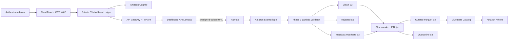

# StreamForge collaborator agent handoff

> **Purpose:** Give a second engineer or coding agent enough context to work
> safely and productively in StreamForge without rediscovering the architecture.
> This is a project briefing, not a source of AWS credentials. Never add
> credentials, Terraform state, generated Lambda archives, or personal AWS
> configuration to the repository.

## Start here

StreamForge is a secure, serverless AWS data platform for customer CSV files.
Users upload a CSV through an authenticated web dashboard. The file is placed
in raw S3 storage, validated by an event-driven Lambda, and separated into
clean and rejected outputs. A Glue transformation job turns clean CSV data into
business-ready, partitioned Parquet for Athena, while malformed transformed
rows go to a quarantine location.

The project is deliberately built in phases:

1. **Phase 1 — ingestion and quality:** S3, EventBridge, Lambda validation,
   clean/rejected output, and lineage manifests.
2. **Phase 2 — query foundation:** Glue crawler and Data Catalog plus Athena
   queries over clean data.
3. **Phase 3 — curation:** Glue business transformations, Parquet/Snappy,
   partitions, metadata enrichment, and quarantine handling.
4. **Phase 4 — platform engineering:** Terraform, encryption, least-privilege
   IAM, operations, CI/CD, dashboard delivery, and security controls.

The intended outcome is a portfolio-quality data engineering platform that is
also safe enough to demonstrate realistic production patterns.

## System architecture



### Data flow in detail

1. The dashboard authenticates users through Cognito Hosted UI using the
   Authorization Code flow with PKCE.
2. The browser calls the JWT-protected API Gateway endpoint.
3. The dashboard Lambda returns a short-lived presigned S3 upload URL. The
   browser uploads directly to the raw bucket; it never receives broad AWS
   credentials.
4. The raw bucket emits an object-created event to EventBridge.
5. EventBridge invokes `streamforge-processor`, the Phase 1 Lambda.
6. Lambda reads the input CSV and applies validation rules. It writes valid
   rows to clean S3, invalid rows to rejected S3, and a JSON sidecar manifest to
   metadata S3.
7. The Phase 3 Glue job reads clean files and Phase 1 manifests, applies
   business/technical transformations, writes good records as partitioned
   Parquet, and writes malformed transformed records to quarantine storage.
8. Glue Catalog exposes the clean and curated layers to Athena.
9. The dashboard can query status metadata and issue short-lived download URLs
   for clean and rejected output.

## Current implementation status

### Completed and versioned in the repository

| Area | Status | Notes |
| --- | --- | --- |
| Phase 1 CSV validation | Implemented | Customer ID, name, email, numeric sales, duplicate-ID handling, error handling, and clean/rejected splitting. |
| Phase 1 lineage manifests | Implemented | Source and processing metadata is written as a sidecar JSON object for downstream enrichment. |
| Event-driven ingestion | Implemented | Raw S3 uses EventBridge; EventBridge invokes the Lambda asynchronously. |
| Phase 2 analytics | Implemented | Glue database, crawler, canonical clean table, and KMS-encrypted Athena results/workgroup are Terraform-managed. |
| Phase 3 ETL | Implemented | Glue job, schemas, Parquet/Snappy output, date partitions, business transformations, threshold-aware quarantine, curated table/workgroup. |
| Web dashboard | Implemented | Cognito sign-in, upload, status polling, valid/rejected counts, and expiring download URLs. |
| Infrastructure as code | Implemented | Reusable Terraform modules plus independent `dev` and `prod` roots. |
| Operational controls | Implemented; alarm exercises pending | CloudWatch alarms/dashboard, encrypted SNS alerts, SQS DLQs, EventBridge failure handling, and runbooks. SNS topic delivery is verified; individual alarm paths still need exercising. |
| Security controls | Implemented | SSE-KMS, private buckets, CloudFront OAC, WAF managed rules, IAM scoping, logging, retention, and TLS enforcement. |
| CI and security scanning | Implemented | Python tests, Lambda packaging checks, Terraform fmt/validate, gitleaks, Trivy, and Checkov. |
| Documentation | Implemented | Architecture, ADRs, runbooks, Terraform import process, GitHub environment setup, disaster recovery, and definition of done. |

### Important live-state caveat

The repository contains the desired infrastructure definition, but a coding
agent must **not assume the AWS account exactly matches the latest commit**.
Before stating that a resource is live or changing it:

1. Confirm the active AWS identity and intended account/region.
2. Run a reviewed Terraform plan for the relevant environment.
3. Treat a plan/apply as a production-impacting action and get the owner's
   approval before applying it.

The most recent hardening work added centralized S3 access logging, CloudFront
logging, WAF logging, dashboard-edge controls, and Checkov remediation. Verify
that the active `dev` environment has had those changes applied before relying
on them operationally.

### Live dev activation snapshot — 2026-07-25

The following has been applied and verified in the development AWS account
(`108379846489`, `us-east-1`). This is a dated operational snapshot, not a
substitute for a new plan before making changes:

- GitHub Actions uses the AWS IAM OIDC provider and assumes
  `streamforge-dev-github-actions`. Its trust policy is restricted to the
  `happi2307/StreamForge` repository and the GitHub `dev` environment; it does
  not use stored AWS access keys.
- The GitHub `dev` environment contains the required state/backend and Terraform
  input variables. A GitHub Actions Terraform plan completed successfully,
  proving OIDC role assumption, KMS decryption, S3 remote-state access, and
  DynamoDB lock-table access.
- The encrypted SNS topic `streamforge-dev-alerts` has a confirmed email
  subscription for `kumarakshat868@gmail.com`. A labelled manual test message
  was delivered successfully. This validates SNS topic delivery, but each
  CloudWatch alarm path still needs a separate exercise.
- The account's Lambda regional concurrency quota is exactly 10. The desired
  configuration reserves five concurrent executions each for the processor and
  dashboard API Lambdas, but AWS must retain 10 unreserved executions. A quota
  increase request is open (case `178482111400370`). Until approved, a full
  Terraform apply will propose these two changes but cannot complete them.
- The repository is public. GitHub `dev` has a required-reviewer protection
  rule for `ashutoshg-2005`, so deployment jobs require an independent approval.
  Production is intentionally not activated because no separate production AWS
  account/role is available.

### CI status at the time of this handoff

The latest commits on `main` addressed GitHub Actions packaging and security
scan failures. CI and security scans passed after those changes. Re-run checks
for the branch and commit you are actually changing; do not treat this note as
evidence for future commits.

## Phase-by-phase behavior

### Phase 1: ingestion, validation, and provenance

Source files:

- `lambda/handler.py` — Lambda entry point and EventBridge/S3 event handling.
- `lambda/validator.py` — validation rules and clean/rejected separation.
- `lambda/metadata.py` — Phase 1 lineage-manifest helpers.
- `tests/test_handler.py` and `tests/test_validator.py` — unit coverage.
- `scripts/run_local.py` — local, no-AWS processing flow.

Validation behavior:

- `customer_id` must be present.
- `name` must not be empty.
- `email` must be valid.
- `sales` must be numeric.
- Duplicate `customer_id` values keep the first valid occurrence.
- Missing files, empty files, malformed CSV, and AWS SDK failures are logged
  rather than failing silently.

Outputs:

```text
raw/<uploaded-object>.csv
clean/<uploaded-object>.csv
rejected/<uploaded-object>.csv
metadata/<uploaded-object>.csv.json
```

The manifest is important: Phase 3 uses it to preserve ingestion context
without changing the clean CSV schema.

### Phase 2: queryable clean layer

Phase 2 treats the clean bucket as the source of truth for validated data.

- Glue crawler discovers clean CSV structures.
- The crawler excludes the metadata prefix.
- Glue Data Catalog stores table metadata.
- Athena queries clean data using the Phase 2 workgroup.
- Athena result output and encryption are enforced at the workgroup level.

Useful reference files:

- `scripts/deploy_phase2.ps1`
- `scripts/phase2_queries.sql`
- `terraform/modules/phase2_analytics/`

### Phase 3: curated business layer

Source files:

- Glue job assets and configuration are modelled in
  `terraform/modules/phase3_curated/`.
- Supporting transformation tests are in `tests/test_transform_helpers.py` and
  `tests/test_transform_job_metrics.py`.
- Sample SQL is in `scripts/phase3_queries.sql`.

Technical transformations:

- CSV to Parquet conversion.
- Snappy compression.
- Schema enforcement and type conversion.
- Partitioning by the source object's ingestion date:
  `year=YYYY/month=MM/day=DD`.

Business transformations:

- Trim and standardize customer names.
- Normalize email addresses.
- Parse sales values and create sales categories.
- Add lineage/operational columns: ingestion timestamp, processing timestamp,
  batch ID, source filename/key, and pipeline version.

Quarantine design:

- Individual malformed transformed rows do not fail an otherwise good batch.
- Bad rows are stored by reason in the quarantine bucket.
- Quarantine records retain the original row, failure reason, source file,
  processing timestamp, and batch ID.
- A configurable invalid-row threshold makes a badly corrupted batch fail
  intentionally instead of silently producing an incomplete dataset.

### Phase 4: platform, security, and operations

Terraform layout:

```text
terraform/
  bootstrap/backend/         # Remote-state bucket and DynamoDB lock table
  environments/dev/          # Active development root
  environments/prod/         # Independent production root
  modules/
    kms/
    s3/
    s3_access_logs/
    phase1_runtime/
    phase2_analytics/
    phase3_curated/
    phase4_operations/
    web_console/
    web_static/
```

Operations implemented:

- Encrypted SNS alert topic.
- SQS dead-letter queues for failed asynchronous/event deliveries.
- CloudWatch alarms for Lambda errors/throttles, EventBridge failures, DLQ
  messages, Glue/Athena failures, and high quarantine rates.
- CloudWatch operational dashboard.
- KMS-encrypted log groups with retention controls.
- Incident runbooks under `docs/runbooks/`.

Architecture decisions are documented in `docs/adr/`:

1. EventBridge routing instead of direct S3-to-Lambda notification.
2. SSE-KMS instead of SSE-S3 for primary project data.
3. Parquet for curated analytics data.
4. Terraform instead of CloudFormation.

## Services and how they are used

| Service | Use in StreamForge | Key security/design decisions |
| --- | --- | --- |
| Amazon S3 | Raw, clean, rejected, metadata, curated, quarantine, Athena results, static dashboard, access logs, and Terraform state. | Primary buckets are private, versioned, Block Public Access enabled, ownership enforced, transport encryption required, and encrypted with SSE-KMS. |
| AWS KMS | Customer-managed encryption keys. | Encrypts primary S3 data, Lambda configuration/logs, Glue configuration, alerting/logs where applicable, and Terraform state. Rotation is enabled. |
| Amazon EventBridge | Routes raw S3 object-created events and operational failure events. | Decouples the raw bucket from Lambda, supports filtering/retries/DLQs, and leaves room for future consumers. |
| AWS Lambda | Phase 1 validator and dashboard API. | Least-privilege IAM, encrypted environment variables/logs, reserved concurrency, X-Ray tracing, and async DLQ. |
| Amazon SQS | Dead-letter queues. | Captures failed asynchronous Lambda invokes and failed EventBridge deliveries for diagnosis/replay. |
| AWS Glue | Data crawler, Data Catalog integration, and Phase 3 ETL. | Uses a security configuration, dedicated IAM roles, encryption, and a quarantine pattern rather than failing for individual bad rows. |
| AWS Glue Data Catalog | Tables/schema metadata for Athena. | Holds canonical clean and curated tables. |
| Amazon Athena | Serverless SQL queries over clean and curated S3 data. | Workgroups enforce encrypted result locations and support query cost governance. |
| Amazon CloudWatch | Logs, metrics, alarms, dashboards, and log retention. | Log groups are explicitly managed and KMS encrypted. |
| AWS X-Ray | Tracing for the Phase 1 Lambda. | Helps diagnose latency and AWS downstream calls. |
| Amazon SNS | Operational alert notifications. | Alert topic is encrypted. The confirmed dev email subscription and a manual delivery test are verified; CloudWatch alarm-action tests remain. |
| Amazon Cognito | Dashboard user authentication. | User Pool/Hosted UI, strong password policy, Authorization Code + PKCE browser flow. |
| Amazon API Gateway | Dashboard HTTP API. | HTTP API routes use a Cognito JWT authorizer; CORS is restricted to approved dashboard origins. |
| Amazon CloudFront | HTTPS delivery of the dashboard. | Uses private S3 origin access control, HTTPS redirect, security headers, and access logging. |
| AWS WAF | Dashboard edge protection. | CloudFront-associated Web ACL uses AWS managed Common Rule Set and Known Bad Inputs rules; WAF logs are sent to encrypted CloudWatch storage. |
| AWS IAM | Authentication and authorization between all services. | Roles are split by responsibility and policies are scoped to specific data buckets, keys, and actions. |
| Amazon DynamoDB | Terraform state locking. | Prevents concurrent state writes during Terraform operations. |
| AWS STS / GitHub OIDC | CI/CD AWS authentication. | GitHub `dev` assumes a short-lived, environment-scoped role; no long-lived AWS access keys are stored in GitHub. Bootstrap/IAM-policy changes remain a local privileged Terraform responsibility to avoid CI self-escalation. |
| Terraform | Infrastructure provisioning and reconciliation. | Reusable modules, remote state, versioning, import guidance, and drift workflow. Not an AWS service. |
| GitHub Actions | CI/CD and security automation. | Tests, packages Linux-compatible Lambda ZIPs, validates Terraform, scans secrets/vulnerabilities/policy, and contains manual deployment/drift workflows. Dev AWS authentication is live through OIDC and short-lived role credentials. |

### Required exception awareness

Do not remove security-scan exceptions casually. They are documented design
trade-offs, not accidental omissions:

- S3 server-access-log destinations use **SSE-S3**, because S3 log delivery has
  an AWS encryption compatibility constraint. Project data buckets still use
  SSE-KMS.
- CloudFront uses its default domain/certificate because no custom domain is
  configured. A custom domain plus ACM certificate is needed to enforce a
  chosen modern TLS policy explicitly.
- Cross-region replication and a CloudFront failover origin are not yet
  implemented. Current recovery relies on S3 versioning and Terraform rebuild.
- Lambda is intentionally not in a VPC because it calls managed AWS services;
  adding a VPC without private dependencies would add NAT/endpoints and
  operational complexity. Revisit this if private VPC data stores are added.
- Lambda code signing is a future hardening item; it requires a real signing
  and release process rather than a cosmetic configuration change.

## Dashboard design

Frontend sources live in `web/`:

- `index.html`, `styles.css`, and `app.js` are the dashboard application.
- `config.template.js` is rendered by Terraform for CloudFront deployment.
- `config.js` is non-secret runtime configuration; do not put credentials in it.

Backend/API responsibility:

- The dashboard API Lambda creates presigned upload/download URLs and reads
  processing/manifests for status.
- The browser uploads directly to S3 via a short-lived URL.
- Cognito authenticates the browser; API Gateway validates its JWT.
- CloudFront is the only intended reader of the private static S3 origin.

For local frontend development:

```powershell
python -m http.server 8000 --directory web
```

Keep local development origin/callback URLs aligned with Terraform/Cognito and
API Gateway CORS configuration. A seemingly harmless change to the frontend
origin can break authentication or presigned uploads.

## CI/CD and deployment model

Workflow files live under `.github/workflows/`:

| Workflow | Purpose |
| --- | --- |
| `ci.yml` | Python tests, Terraform formatting/validation, Linux Lambda packaging, ZIP validation and size limit. |
| `security.yml` | gitleaks, Trivy filesystem scan, and Checkov Terraform policy checks. |
| `terraform-plan.yml` | Plan for `dev` on relevant pull requests/manual dispatch; requires OIDC environment variables. |
| `terraform-apply-dev.yml` | Manually dispatched `dev` deployment with literal confirmation and GitHub environment approval. |
| `terraform-apply-prod.yml` | Manually dispatched production deployment after the separate production approval gate. |
| `terraform-drift.yml` | Scheduled/manual dev drift detection. |

The live GitHub `dev` environment contains these backend/authentication variables:

```text
AWS_ROLE_TO_ASSUME
AWS_REGION
TF_STATE_BUCKET
TF_STATE_KEY
TF_LOCK_TABLE
```

It also contains non-secret `TF_VAR_*` values for the deployed bucket-name
overrides, ownership/cost tags, and KMS configuration. The workflows map the
uppercase GitHub variable names to Terraform's case-sensitive lowercase input
environment variables. Do not replace this with AWS access-key secrets.

The intended promotion path is:

```text
Feature branch -> CI -> pull request -> dev Terraform plan
  -> approved dev deployment -> integration test
  -> approved production deployment
```

The OIDC AWS roles and GitHub environment protections are an important
activation step. Do not add AWS access keys as GitHub secrets as a shortcut.

## Safe working rules for a collaborator agent

1. **Read before changing.** Start with `README.md`, this file,
   `docs/architecture.md`, the appropriate Terraform environment, and the
   relevant module/source/tests.
2. **Do not deploy implicitly.** `terraform apply`, direct AWS writes, and
   GitHub deployment dispatches need the project owner's explicit approval.
   A reviewed `terraform plan` is the normal precursor.
3. **Keep secrets out of Git.** Never commit `terraform.tfvars`, `backend.hcl`,
   AWS CLI credentials, `.env` files, Cognito client secrets, Terraform state,
   Lambda ZIPs, or presigned URLs.
4. **Preserve least privilege.** Do not expand IAM actions/resources to `*`
   merely to make a deployment work. Diagnose the missing permission and scope
   the correction precisely.
5. **Preserve data lineage.** Any schema/output change must account for Phase 1
   manifests, Phase 3 metadata columns, partitions, Glue tables, Athena SQL,
   dashboard status behavior, and tests.
6. **Avoid public S3 shortcuts.** Dashboard hosting is private behind
   CloudFront OAC. Do not make the website, data, access-log, or state buckets
   public to solve access problems.
7. **Use a branch and narrow commits.** Do not mix formatting, features,
   Terraform changes, and unrelated cleanup in one commit.
8. **Validate proportionally.** Run local tests and Terraform validation for
   every relevant change. A cloud-impacting change also needs a reviewed plan
   and post-deploy smoke test.
9. **Do not edit user-owned workspace files.** At this handoff snapshot,
   `sample_data/customers - Copy.csv` and
   `sample_data/customers - Copy - Copy.csv` are untracked user files. Leave
   them untouched unless the owner specifically asks otherwise.
10. **Document architectural changes.** Add or update an ADR, runbook, and
    README/architecture material when a change affects a security or platform
    decision.

## Local setup and verification

Use Python 3.12 for Lambda-compatible local testing, even if a newer Python is
installed globally.

```powershell
py -3.12 -m venv .venv
.\.venv\Scripts\Activate.ps1
python -m pip install -r requirements-dev.txt
python -m pytest
```

Useful verification commands:

```powershell
# Local Phase 1 flow without AWS
.\.venv\Scripts\python.exe scripts\run_local.py sample_data\customers.csv

# Terraform static checks; no remote backend or cloud changes
terraform fmt -check -recursive terraform
terraform -chdir=terraform/bootstrap/backend init -backend=false
terraform -chdir=terraform/bootstrap/backend validate
terraform -chdir=terraform/environments/dev init -backend=false
terraform -chdir=terraform/environments/dev validate
terraform -chdir=terraform/environments/prod init -backend=false
terraform -chdir=terraform/environments/prod validate

# Rebuild Linux-compatible Lambda archives as CI does
python scripts/package_lambdas.py --environment dev --include-dashboard
```

For a real environment, first verify the caller identity. Use the configured
non-root AWS profile rather than a root account:

```powershell
aws --profile testing sts get-caller-identity
```

Only run Terraform with the correct initialized backend and approved variables.
The current S3 backend configuration still uses DynamoDB locking; Terraform may
emit a deprecation warning for `dynamodb_table`. Plan a controlled migration to
S3 lockfiles (`use_lockfile`) rather than making an unreviewed backend change.

## Current roadmap / work remaining

### Needed to finish the platform activation

1. Exercise the applicable CloudWatch alarm paths and record the delivery
   evidence in the related runbooks.
2. Wait for or obtain a Lambda regional concurrency quota increase, then run a
   reviewed full dev Terraform apply to set the two five-execution reservations.
3. Configure an independent reviewer/team as the GitHub `dev` environment
   protection rule. Do not use the repository owner as a cosmetic approval
   gate.
4. Create and validate the independent production environment in its target AWS
   account; do not reuse dev credentials or state.
5. Run a full AWS smoke test: dashboard upload, EventBridge/Lambda execution,
   clean/rejected/manifest outputs, Glue curated output, Athena query, and
   dashboard downloads.

### Recommended production-maturity improvements

1. Add a custom domain and ACM certificate to CloudFront, then enforce a
   modern TLS policy.
2. Add cross-region replication, a recovery-region design, and CloudFront
   origin failover if stricter DR objectives are required.
3. Add Lambda code signing as part of a trusted release process.
4. Add WAF rate limiting/bot controls after reviewing expected traffic and cost.
5. Pin GitHub Actions by immutable commit SHA and remove remaining deprecated
   Node runtime warnings from third-party actions.
6. Add cloud integration tests that upload a known CSV and verify every data
   layer automatically.
7. Consider Step Functions or an explicit orchestration trigger for Glue when
   multiple jobs, replay, or richer batch state transitions are needed.
8. Define a formal schema-evolution/data-contract process for new columns,
   renamed fields, and type changes.

## Key documentation map

| Need | Read this first |
| --- | --- |
| Overall project and local use | `README.md` |
| Phase requirements/history | `pipeline.md` |
| Architecture | `docs/architecture.md` |
| Terraform layout | `terraform/README.md` |
| Adopting existing AWS resources | `docs/terraform-import-guide.md` |
| GitHub environments/OIDC | `docs/github-environments.md` |
| Disaster recovery objectives | `docs/disaster-recovery.md` |
| Completion criteria | `docs/definition-of-done.md` |
| Production root guidance | `terraform/environments/prod/README.md` |
| Incident response | `docs/runbooks/` |
| Architectural decisions | `docs/adr/` |

## Fast onboarding checklist

- [ ] Read this handoff, `README.md`, and `docs/architecture.md`.
- [ ] Run `git status --short --branch` and preserve unrelated/untracked files.
- [ ] Run the Python test suite.
- [ ] Run Terraform formatting and offline validation.
- [ ] Identify whether the task changes Phase 1, Phase 2, Phase 3, Phase 4,
      dashboard, or deployment/operations behavior.
- [ ] Read the relevant tests, Terraform module, ADR, and runbook before
      editing.
- [ ] For AWS work, confirm profile/account/region and make a plan before an
      apply.
- [ ] Check the dated live-dev activation snapshot above before selecting the
      next deployment or operational task.
- [ ] Update tests and documentation with every behavior or architecture change.
