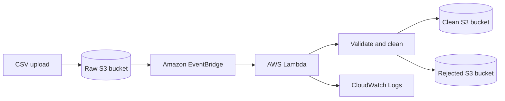
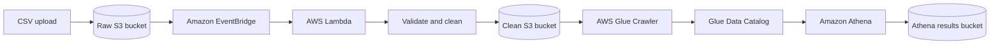
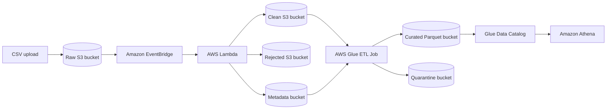

# Phase 1 Architecture

Only the raw bucket emits object-created events. EventBridge routes those events
to the Python 3.12 Lambda. The Lambda reads the object, applies the validation
rules, and writes separate CSV outputs to the clean and rejected buckets.

## Phase 2 Architecture

Phase 2 keeps the Phase 1 ingestion path intact and adds a query layer over the
clean bucket. The Glue crawler infers schema from the cleaned CSV data, the
catalog stores the metadata, and Athena runs SQL queries whose results are
written to a separate KMS-encrypted results bucket.

## Phase 3 Architecture

Phase 3 reads both the clean CSV objects and the Phase 1 sidecar manifests. The
Glue job applies business transformations, enriches records with lineage
metadata, writes valid rows to partitioned Parquet, and writes malformed
transformed rows to a quarantine location instead of failing the whole batch by
default.
