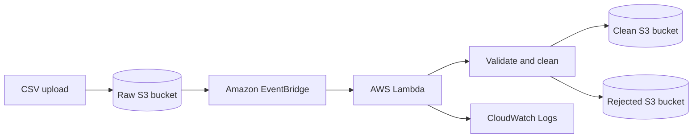

# Phase 1 Architecture

Only the raw bucket emits object-created events. EventBridge routes those events
to the Python 3.12 Lambda. The Lambda reads the object, applies the validation
rules, and writes separate CSV outputs to the clean and rejected buckets.

