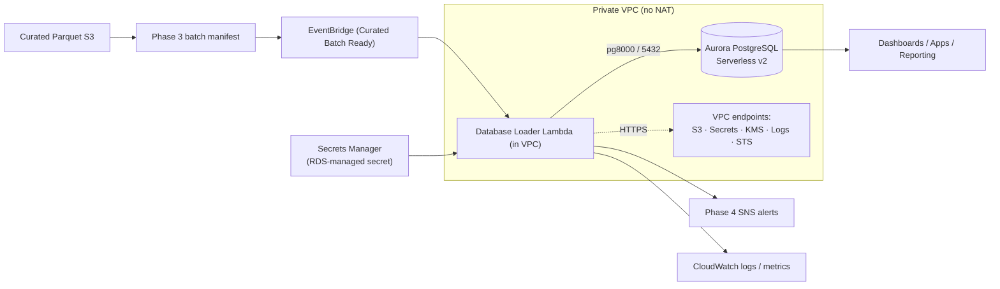
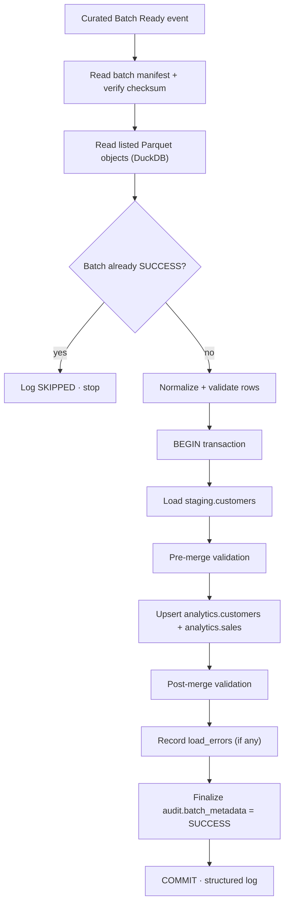
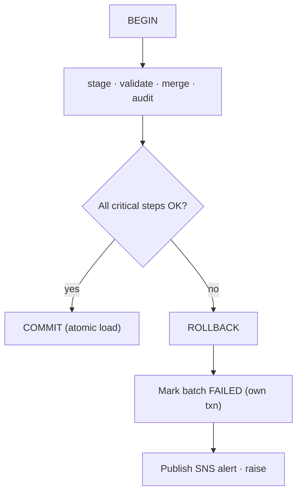
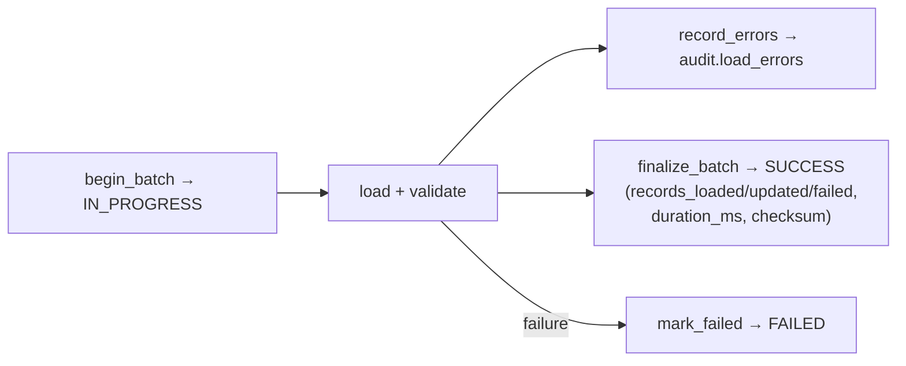
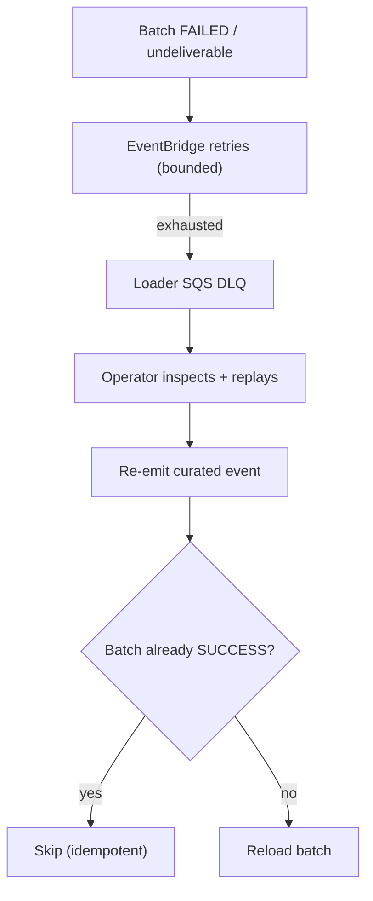

# Phase 5 — database architecture

The Phase 5 serving layer loads the Phase 3 curated Parquet dataset into an
Amazon Aurora PostgreSQL database so dashboards, applications, and reporting can
query production-ready, indexed, transactional tables. It integrates with the
existing pipeline without changing Phases 1–4.

See [ADR 005](adr/005-aurora-serverless-v2-serving-layer.md) for the engine,
networking, and driver decisions, and
[the loader runbook](runbooks/phase5-database-loader.md) for operations.

## Database architecture



### Schemas and tables

| Schema | Table | Purpose |
| --- | --- | --- |
| `staging` | `customers` | Disposable per-batch landing zone (UNLOGGED); mirrors the curated row shape. |
| `analytics` | `customers` | Production customer records. **PK / upsert key: `customer_id`.** |
| `analytics` | `sales` | Per-customer, per-batch sales fact. Unique `(customer_id, batch_id)`; FK to `analytics.customers`. |
| `audit` | `batch_metadata` | One row per batch; source of truth for idempotency. `status ∈ IN_PROGRESS/SUCCESS/FAILED/SKIPPED`. |
| `audit` | `load_errors` | Rejected records captured during a load. |

DDL lives in `database/schema.sql`, `database/indexes.sql`, and
`database/constraints.sql`. Indexes cover the business keys `customer_id`,
`batch_id`, and `processed_timestamp`. Terraform packages these scripts with
the private loader and invokes its idempotent bootstrap after Aurora is ready.

Column names mirror the Phase 3 curated dataset produced by
`jobs/transform_helpers.py`; the Phase 3 `phase3_batch_id` is the Phase 5
`batch_id`.

## Loading workflow



Never load directly into production: curated → staging → validate → MERGE →
production. The upsert uses `INSERT ... ON CONFLICT (customer_id) DO UPDATE`
(the portable PostgreSQL MERGE idiom; `sql/merge.sql` also documents the
SQL:2003 `MERGE`). Reserved loader concurrency of 1 serialises a batch's
multiple Parquet part-file events; idempotency turns the extras into no-ops.

## Transaction flow



The whole batch is one transaction — **no partial loads**. A critical failure
rolls the batch back; the batch is then marked `FAILED` in a separate committed
transaction and an SNS alert is published. Individual bad *records* do not fail
the batch: they are written to `audit.load_errors` and processing continues.

## Audit workflow



`audit.batch_metadata` records `records_loaded`, `records_updated`,
`records_failed`, `duration_ms`, `status`, and a content `checksum` per batch.
Operational queries are in `sql/audit_queries.sql`.

## Retry / recovery flow



EventBridge retries failed deliveries a bounded number of times before parking
the event in the loader DLQ for investigation and replay. Because loads are
idempotent by `batch_id`, replaying is always safe.

## Validation

**Pre-merge** (against staging): row count > 0, mandatory fields present,
non-negative numeric sales, no duplicate business keys.
**Post-merge**: source row count equals destination row count for the batch,
staged total sales equals loaded total sales, and no duplicate customers in
production. Any failed invariant aborts the transaction. Queries are in
`sql/validation.sql`.

## Security

- Aurora is KMS-encrypted (storage + the RDS-managed secret) and private to the
  VPC; only the loader security group may reach it on 5432.
- The loader reads credentials from Secrets Manager at runtime — never from code
  or plaintext environment variables.
- IAM is least-privilege: read curated/metadata objects, read the one cluster
  secret, use the CMK, publish to the alert topic, send to its DLQ, and manage
  its own VPC ENIs (`AWSLambdaVPCAccessExecutionRole`).

## Performance tuning

- `pg8000` connection is cached across warm invocations (connection reuse).
- Batch upserts run as set-based `INSERT ... SELECT ... ON CONFLICT` statements.
- Indexes cover `customer_id`, `batch_id`, and `processed_timestamp`.
- `staging.customers` is UNLOGGED for load throughput.
- Aurora Serverless v2 scales ACUs between the configured min/max under load.

## Monitoring

The `streamforge-dev-phase5-serving` CloudWatch dashboard shows loader
invocations/errors/duration, records loaded vs rejected, Aurora
capacity/connections, and DLQ depth. Alarms (loader errors, duration,
DLQ messages, excessive failed records) publish to the existing Phase 4 SNS
topic.

## Deployment (code + IaC; offline-validated)

Phase 5 is delivered as Terraform + Lambda + SQL, validated offline (no live
apply), consistent with earlier phases.

```powershell
# 1. Build the loader archive (Linux-compatible wheels)
python scripts/package_lambdas.py --environment dev --include-dashboard --include-loader

# 2. Offline Terraform checks
terraform fmt -check -recursive terraform
terraform -chdir=terraform/environments/dev init -backend=false
terraform -chdir=terraform/environments/dev validate

# 3. A reviewed Terraform apply bootstraps the packaged schema automatically.
```
