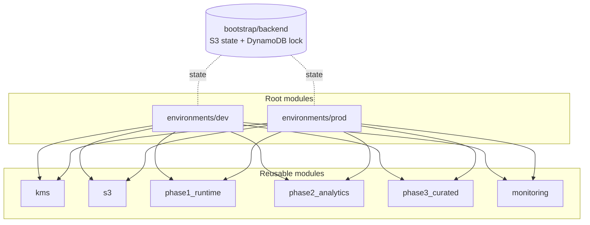
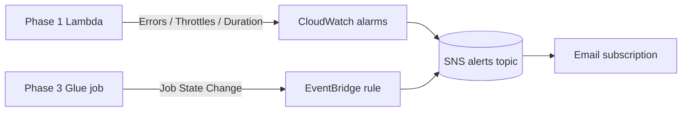

# Diagrams

## Terraform module layout

## Monitoring and notification flow

The infrastructure topology for the data plane itself is in
[../architecture.md](../architecture.md). CI/CD and security-architecture
diagrams are added as those workflows land.
