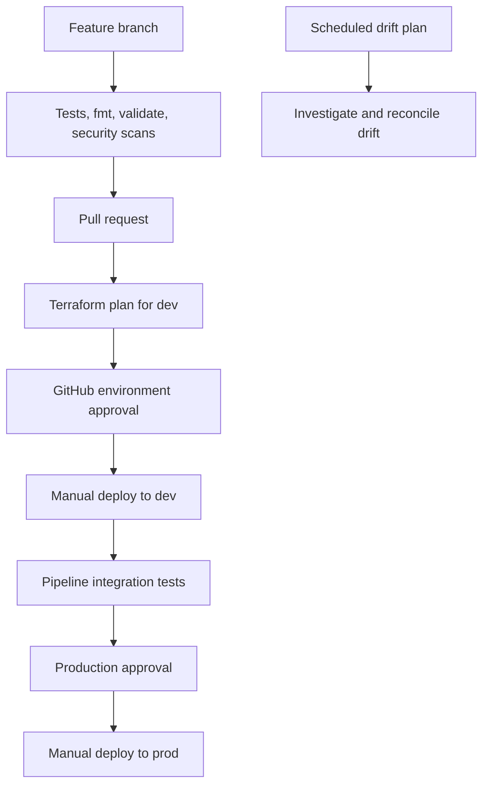

# CI/CD and promotion flow

GitHub Actions uses OIDC roles configured per GitHub environment. Terraform
apply is intentionally manual and environment-gated; pull requests never
create infrastructure.
