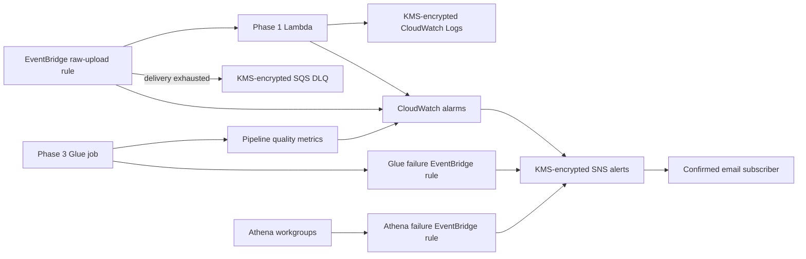

# Monitoring flow

The dashboard combines Lambda error/throttle metrics, EventBridge delivery
failures, and batch-level Phase 3 data-quality metrics. Alerts do not contain
customer records or source file contents.
